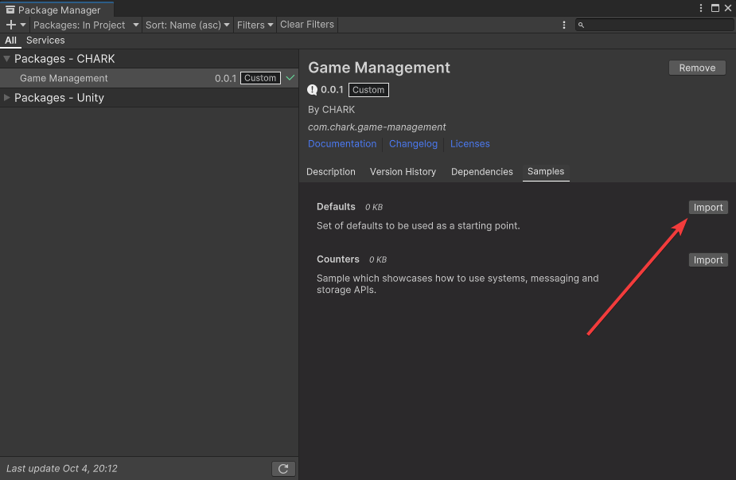

[Unity Package Manager]: https://docs.unity3d.com/Manual/upm-ui.html
[Changelog]: ../CHANGELOG.md

[Samples~]: ../Samples%7E
[Defaults Sample]: ../Samples%7E/Defaults

[Game Manager]: ../Runtime/GameManager.cs
[Game Manager Settings]: ../Runtime/GameManagerSettings.cs

[Default Game Manager]: ../Samples%7E/Defaults/Scripts/DefaultGameManager.cs
[Default Game Manager Prefab]: ../Samples%7E/Defaults/Prefabs/DefaultGameManager.prefab
[Default Game Manager Settings]: ../Samples%7E/Defaults/Resources/DefaultGameManagerSettings.asset

[SimpleSystem]: ../Runtime/Systems/SimpleSystem.cs
[MonoSystem]: ../Runtime/Systems/MonoSystem.cs
[IMessage]: ../Runtime/Messaging/IMessage.cs

[IFixedUpdateListener]: ../Runtime/Systems/IFixedUpdateListener.cs
[IUpdateListener]: ../Runtime/Systems/IUpdateListener.cs

# Documentation

This package provides a set of runtime scripts for use as a backbone for your game. It is code-first, so you'll need quite a lot of C# code to use this package.

Make sure to keep any eye for breaking changes in [Changelog].

## Getting Started

Open [Unity Package Manager], select _Game Management_ package and import [Defaults Sample]:

<p align="center">
  
</p>

This will import:

- [Default Game Manager] - script which can be used as a template for your custom game manager.
- [Default Game Manager Prefab] - prefab which can be used as a template for your custom game manager. By default, it has the [Default Game Manager] component.
- [Default Game Manager Settings] - settings asset used to define how the [Default Game Manager] should load.

After importing, hit play and the [Default Game Manager] should instantiate and be ready to go!

## Game Manager Settings

Regardless if you use a [Game Manager] from [Samples~] or a custom one, you'll need to define a [Game Manager Settings] asset. This asset will be created automatically in `Resources` directory by the game management code. However, if that doesn't happen, right-click anywhere in the _Project Window_ and select _Create/CHARK/Game Management/Game Manager Settings_ and create it manually:

<p align="center">
  
</p>

Available properties for customization:

- **Is Active Settings** - useful when you have multiple [Game Manager Settings] assets. You can use this field to define which settings asset should be used.
- **Is Instantiate Automatically** - should [Game Manager] be instantiated automatically when the game starts. Disable this if you want to manage the lifecycle manually.
- **Game Manager Prefab** - [Game Manager] prefab to instantiate when the game starts, used when **Is Instantiate Automatically** is set to `true`.
- **Load Type** - when to load the [Game Manager], for more info see [InitializeOnLoadAttribute](https://docs.unity3d.com/ScriptReference/InitializeOnLoadAttribute.html).

## Scripting

[Game Manager] provides a set of static methods to interact with its functionality. Additionally, it is fully customizable, meaning you can override how it sends messages by supplying custom implementations in of various sub-systems.

### Game Manager

The starting point when using this package should be a class that inherits [Game Manager]. Here you can define your systems, initialize game state and override default behavior:

```csharp
using CHARK.GameManagement;
using CHARK.GameManagement.Assets;
using CHARK.GameManagement.Entities;
using CHARK.GameManagement.Messaging;
using CHARK.GameManagement.Storage;

internal sealed class MyGameManager : GameManager
{
    protected override void OnBeforeInitializeSystems()
    {
        // Initialize systems here
        // AddSystem(...);
    }

    protected override void OnAfterInitializeSystems()
    {
        // Do stuff with systems here after they're initialized and handle general game init logic
    }

    protected override void OnBeforeDestroy()
    {
        // Cleanup your game
    }

    protected override string GetGameManagerName()
    {
        return "My Game Manager";
    }

    protected override IGameStorage CreateRuntimeGameStorage()
    {
        // Provide a custom storage solution
    }

    protected override IResourceLoader CreateResourceLoader()
    {
        // Provide a custom resource loading solution
    }

    protected override IEntityManager CreateEntityManager()
    {
        // Provide a custom entity storage solution (used for service locator)
    }

    protected override IMessageBus CreateMessageBus()
    {
        // Provide a custom messaging solution
    }
}
```

Some things to keep in mind:

- All of the `override` methods are optional.
- It is safe to retrieve systems in `OnAfterInitializeSystems` method.
- `OnInitialized` method of each system is called in the order you add them.

### Game Manager Static Methods

To communicate with the currently active management backend in your regular components and gameplay code, use static methods exposed on [Game Manager] class:

```csharp
// Retrieve a set of systems
var systems = GameManager.GetSystems<IMySystem>();

// Retrieve system or throw an exception if its missing
var system = GameManager.GetSystem<IMySystem>();

// Retrieve a system
if (GameManager.TryGetSystem<IMySystem>(out var system))
{
}

// Subscribe to messages
GameManager.AddListener<MyMessage>(message => { });

// Unsubscribe from messages
GameManager.RemoveListener<MyMessage>(message => { });

// Publish a message
GameManager.Publish(new MyMessage());

// Load a set of resources
var resources = GameManager.LoadResources<MyResource>();

// Load a single resource
var resource = GameManager.LoadResource<MyResource>();

// Load a value asynchronously
var value = await GameManager.GetRuntimeValueAsync<MyValue>("some-key");

// Load a value synchronously
if (GameManager.TryGetRuntimeValue<MyValue>("some-key", out var value))
{
}

// Save a value asynchronously
await GameManager.SetRuntimeValueAsync("some-key", value);

// Save a value synchronously
GameManager.SetRuntimeValue("some-key", value);

// Delete a value synchronously
GameManager.DeleteRuntimeValue("some-key");

// Load an Editor value synchronously
if (GameManager.TryGetEditorValue<MyValue>("some-key", out var value))
{
}

// Save an Editor value synchronously
GameManager.SetEditorValue("some-key", value);

// Delete an Editor value synchronously
GameManager.DeleteEditorValue("some-key");
```

### Systems

When creating custom systems you have two options to inherit from:

- [SimpleSystem] - a system which is a plain old C# class.
- [MonoSystem] - system which inherits a [MonoBehaviour](https://docs.unity3d.com/ScriptReference/MonoBehaviour.html) and will enable you to use [SerializeField](https://docs.unity3d.com/ScriptReference/SerializeField.html) and other Unity serialization goodies. The caveat is that it's harder to inject such systems into your [Game Manager].

Here are some examples:

```csharp
internal sealed class MyMonoSystem : MonoSystem
{
    [SerializeField]
    private string foo;

    public override void OnInitialized()
    {
    }

    public override void OnDisposed()
    {
    }
}

internal sealed class MySimpleSystem : SimpleSystem
{
    public override void OnInitialized()
    {
    }

    public override void OnDisposed()
    {
    }
}
```

If you'd like you systems to receive `Update` or `FixedUpdate` callbacks, inherit [IFixedUpdateListener] or [IUpdateListener]:

```csharp
internal sealed class MySimpleSystem : SimpleSystem, IFixedUpdateListener, IUpdateListener
{
    public override void OnInitialized()
    {
    }

    public override void OnDisposed()
    {
    }

    public void OnFixedUpdated(float deltaTime)
    {
    }

    public void OnUpdated(float deltaTime)
    {
    }
}
```

### Messaging

To create and send custom messages, define a class which inherits [IMessage] and you're ready to go:

```csharp
internal readonly struct MyMessage : IMessage
{
}
```

Afterward you can fire away your messages like so:

```csharp
GameManager.Publish(new MyMessage());
```